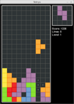

# Tetrys #

Tetrys is a minimalist [Tetris](http://en.wikipedia.org/wiki/Tetris) clone written using
[Pygame](http://www.pygame.org/). I started it as a project to teach my girlfriend the basics of game development in
what I think is the easiest language for programming newbies: Python. It is cross-platform compatible and has basic
gamepad support (there is no way to configure what the buttons do; that is an exercise left to the reader).

Upon running the application you can press `N` to start a new game, and then use the `Left` and `Right` keys to move the
current tetrad around the screen. The `Down` key accelerates the descent of the current piece, and `Space` drops it to
the bottom of the well instantly. A small "shadow tetrad" at the bottom of the well indicates where the current tetrad
will fall if left where it is.

## Screenshots ##

## License ##

MIT
